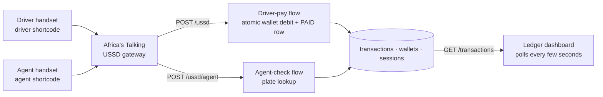

# AgberoRecon

USSD settlement and reconciliation for informal transport levies in Lagos: a driver pays the day's park levy from a pre-funded wallet on a feature phone, the union agent checks any plate and gets `PAID` or `UNPAID` in seconds, and one shared ledger records every payment and every unpaid bus — no smartphone, no internet, no cash.

| Surface | Path / Command | Status |
| --- | --- | --- |
| **Driver USSD flow** | `POST /ussd` — menu -> plate -> confirm -> `END Levy paid. Balance: N…` | **VERIFIED** |
| **Agent USSD flow** | `POST /ussd/agent` — plate in, `PAID` with the time it was paid, or `UNPAID` | **VERIFIED** |
| **Ledger API for the dashboard** | `GET /transactions` · `/transactions/summary` · `/vehicles/:plate/status` | **VERIFIED** |
| **Ledger dashboard (Next.js + Tailwind)** | `frontend/` — polling UI, still rendering fixture rows | **PARTIAL** |
| **Automated verification** | `npm test` runs 34 tests (24 hermetic, 10 over real HTTP against real PostgreSQL) | **34/34 PASS** |
| **USSD session state** | `sessions` table, 10-minute expiry, swept in-process — no Redis | **VERIFIED** |
| **Deployment** | Railway/Render + Vercel — steps in [`backend/README.md`](backend/README.md) | **NOT DEPLOYED** |
| **Demo video** | 4-beat recording script in §7 | **TO RECORD** |

## 1. For judges: two ways in

1. **The dial-in loop (feature phone, no data connection):** post the Africa's Talking callback fields to `POST /ussd` as a driver, then to `POST /ussd/agent` as an agent. The whole walk is copy-pasteable curl in §6 and takes about fifteen seconds of dialling; it needs no host and no tunnel.
2. **The ledger:** `GET /transactions`, `GET /transactions/summary` and `GET /vehicles/:plate/status` return exactly what the dashboard cards render, in park-local time, so the demo needs no explaining.

## 2. What it does

Lagos has an estimated 75,000+ commercial minibuses ("Danfos") paying daily cash levies to union agents ("Agberos") at motor parks and bus stops. Around ₦45bn a year moves with no digital record, payment is proven only by a paper ticket or the agent's word, and the cost of that uncertainty and the disputes around it is passed to commuters as higher fares. The obvious fix — replacing the union's role in fare collection — was already tried (Gona) and died of union resistance, not of technology.

AgberoRecon leaves the existing driver–agent interaction exactly as it is and puts a settlement layer underneath it: the same instant, roadside, no-smartphone transaction, with a permanent auditable record behind it.

## 3. The mechanism



**Core invariant:** *the handset is told what the ledger already knows.* Every "has this bus paid today?" answer — the agent's screen, the dashboard's dispute count — resolves to one query against `transactions`, evaluated in `Africa/Lagos` rather than UTC, so no two parts of the system can disagree about it.

Node.js + Express on PostgreSQL, three tables and nothing else. USSD is stateless — every keypress is a fresh HTTP request — so a phone number's menu position is a row with an `updated_at`, and an abandoned session expires instead of being guessed at. Two partial unique indexes carry the rules a race must not be able to break: one `PAID` row per plate per day (a double-tap cannot double-charge) and one `UNPAID` row per plate per day (a re-check cannot inflate the dispute count). The levy is a fixed ₦500, never typed by the driver, so it can never be underpaid. Plates are matched with separators ignored, because a hyphen is awkward on a feature-phone keypad.

## 4. Production status & boundaries

| Layer | Responsibility | Status |
| --- | --- | --- |
| **Driver-pay flow** (`src/ussd.js`) | Plate must match the wallet's registered plate; wallet debit and `PAID` row commit in one transaction, so a failed payment never leaves a half-applied balance | **VERIFIED** |
| **Agent-check flow** (`src/agent.js`) | Plate in, `PAID` with the time it was paid, or `UNPAID`; the first unpaid detection of the day becomes the ledger's dispute row | **VERIFIED** |
| **Shared ledger** (`src/ledger.js`) | One definition of "paid today", used by both flows and the API, so they cannot diverge | **VERIFIED** |
| **Dashboard API** (`src/dashboard.js`) | Read-only feed, today's totals, and the same plate lookup the agent gets; `no-store`, CORS for a separately hosted dashboard, `400` on malformed filters | **VERIFIED** |
| **Ledger dashboard** (`frontend/`) | Live table and KPI cards; the API contract is ready and documented, the component still renders fixtures | **PARTIAL** |
| **Automated verification** | `npm test`: input normalisation and guards without a database; the whole loop over real HTTP against real PostgreSQL | **34/34 PASS** |

## 5. Track & judging criteria targeted

Civic Tech & Public Good / FinTech & Commerce.

- **Technical execution** — real session-state handling over a stateless protocol, atomic money movement, and the two daily rules enforced in the database rather than by convention. Proven by `npm run test:integration`, which includes a double-tap and two agents checking the same bus at the same moment.
- **Problem fit** — a quantified local problem (₦45bn/yr of untracked cash) with a documented prior failure (Gona) that explains why the obvious approach does not work.
- **Demo & communication** — a before/after that needs almost no explanation: a bus either has its daily record or it does not, and both the agent's screen and the dashboard say so.
- **Originality** — targets the driver–union settlement layer, not the already-tried commuter payment layer, and requires nothing new from anyone on the street.

## 6. Quick start & independent verification

```bash
# 1. Backend + database. PostgreSQL is the only infrastructure it needs.
git clone https://github.com/samuel-cyber/AgberoRetcon.git
cd AgberoRetcon/backend
npm install
cp .env.example .env                 # DATABASE_URL is the only required value
npm run db:init                      # idempotent: tables + both daily constraints
npm run db:seed -- +2348000000000 LND-234-XY 5000   # pre-fund one demo driver
npm run dev                          # http://localhost:3000

# 2. Verify the loop yourself. The database-backed tests skip rather than fail
#    when no database is reachable, so `npm test` is safe to run anywhere.
npm test                             # 34 tests: 24 hermetic, 10 over the real HTTP callbacks
npm run test:integration             # just the driver -> agent -> dashboard loop

# 3. Dashboard, on its own port: the API owns 3000.
cd ../frontend && npm install && npm run dev -- -p 3001
```

No host and no tunnel are needed to see the whole loop — this is the dial, as Africa's Talking posts it (`text` accumulates across keypresses):

```bash
# Driver: menu -> plate -> confirm -> paid
curl -s -X POST --data-urlencode 'phoneNumber=+2348000000000' --data-urlencode 'text='            localhost:3000/ussd
curl -s -X POST --data-urlencode 'phoneNumber=+2348000000000' --data-urlencode 'text=1'           localhost:3000/ussd
curl -s -X POST --data-urlencode 'phoneNumber=+2348000000000' --data-urlencode 'text=1*LND234XY'  localhost:3000/ussd
curl -s -X POST --data-urlencode 'phoneNumber=+2348000000000' --data-urlencode 'text=1*LND234XY*1' localhost:3000/ussd
#   -> END Levy paid. Balance: N4500. Ref: #1

# Agent: menu -> plate (hyphens optional) -> the answer the handset shows
curl -s -X POST --data-urlencode 'phoneNumber=+2348011111111' --data-urlencode 'text='             localhost:3000/ussd/agent
curl -s -X POST --data-urlencode 'phoneNumber=+2348011111111' --data-urlencode 'text=1'            localhost:3000/ussd/agent
curl -s -X POST --data-urlencode 'phoneNumber=+2348011111111' --data-urlencode 'text=1*LND-234-XY' localhost:3000/ussd/agent
#   -> END Plate: LND-234-XY
#      PAID - 7:42am

# Dashboard: the same ledger, the totals, and the agent's lookup
curl -s localhost:3000/transactions/summary
curl -s 'localhost:3000/transactions?status=UNPAID'
curl -s localhost:3000/vehicles/LND-234-XY/status
```

Full menu trees, every endpoint, every environment variable, the AT callback URLs and the deploy steps are in [`backend/README.md`](backend/README.md).

## 7. Demo path (recording script)

| Beat | Length | What is on screen |
| --- | --- | --- |
| **1. The problem** | 15s | The one number that matters: ~₦45bn/year in untracked cash levies, and why "just replace the union" already failed (Gona) |
| **2. The loop** | 45s | Split screen — USSD simulator on one side, dashboard on the other: dial as the driver and pay `LND-234-XY`, the new row appears live, then dial as the agent, check the same plate, `PAID`. This beat needs the dashboard wired to `GET /transactions` — the one open item in §8, and the only thing standing between this script and a take |
| **3. Why it is different** | 20s | It does not remove the union or demand a smartphone; it digitises the interaction that already happens, on the phones people already carry |
| **4. What it unlocks** | 10s | Fiscal transparency and less arbitrary fare inflation, on a protocol that generalises to other informal levy and toll systems |

## 8. Honest boundaries

- **No real money moves.** Wallets are pre-funded for the demo (`npm run db:seed`); production would fund them through a mobile money API. The daily batch payout to the union's account is described, not built.
- **Only the first unpaid detection of the day is written.** A plate that has paid already owns its `PAID` row, so a successful check writes nothing at all: the ledger records state changes, not agents pressing keys.
- **An unregistered plate is answered `UNPAID` but kept out of the ledger** — on a feature-phone keypad that is a typo, not a dispute.
- **The dashboard still renders fixture rows.** The API it needs is live and documented; wiring the component is the remaining piece.
- **Nothing is deployed.** A live Africa's Talking dial needs the callback reachable from the internet (a host or a tunnel), and the sandbox needs two USSD codes — or one code plus `AGENT_SERVICE_CODE`. Everything in §6 works without either.
- **The dashboard API is unauthenticated by default**, and its rows carry the dialling phone numbers. `DASHBOARD_API_KEY` closes that before the ledger is exposed anywhere real.

## 9. Who built what

| Person | Owns |
| --- | --- |
| **Samuel** | Africa's Talking integration, the driver-pay flow and USSD session state, the `wallets` / `transactions` / `sessions` schema, deployment |
| **Ayodeji** | The agent-check flow (plate lookup, PAID/UNPAID logic), the dashboard-facing API, and integration testing of the full driver -> agent -> dashboard loop |
| **Ridwan** | The dashboard UI (Next.js + Tailwind), polling and API wiring, README polish, video edit |

## Credits

Built for the **StacStart Borderless Bytes Hackathon 2026** — Civic Tech & Public Good / FinTech & Commerce track. The **Africa's Talking** USSD sandbox is the gateway for both flows: it is how they were developed, and its simulator is how the demo gets recorded. No vendored assets.
